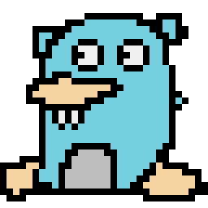

### Motivation behind this article

### Making you put in extra work
When passing an optional int, makes you allocate some shit then pass the result
### Unclear communication
#### Optional types have to be pointers

Shoutout to [Matthias Endler](https://github.com/mre) for getting me to start writing out my thoughts, after many discussions on the topic of this article.
