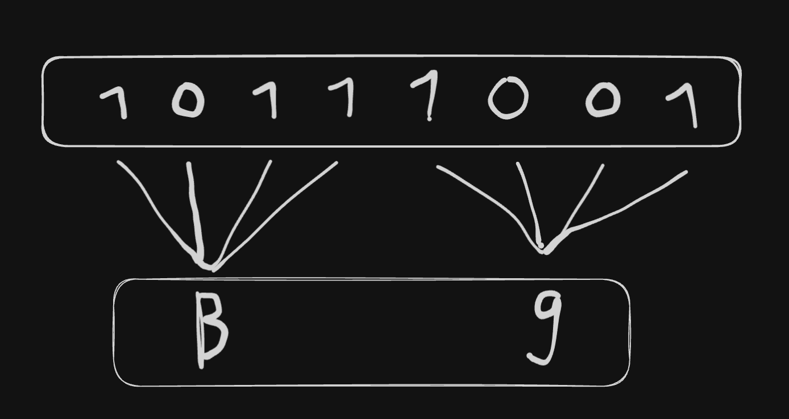

-   A number base is how we represent numbers in different systems.
-   For any base x, the digits from right to left (0-indexed) represent the value x^index
-   Common number bases:
    -   [binary](./binary.md) (2)
    -   octal (8)
    -   decimal (10)
    -   hexadecimal (16)
        -   digits 0 through 9 continued by A through F
    -   64
-   Examples:
    -   For base 10, the number 567 can be broken down into:
        -   7 x 10^0 + 6 x 10^1 + 5 x 10^3
    -   Binary : 1011
        -   1 x 2^0 + 1 x 2^1 + 0 x 2^2 + 1 x 2^3
        -   1 + 2 + 8 = 11 in decimal
-   Representation
    -   Commonly, you will encounter numbers like `0b11001010` or `0xDEADBEEF`
    -   These are conventions that we have chosen to follow, and it helps to rember the common prefixes:
        -   `0b` for binary, `0o` for octal and `0x` for hex
        -   in the absence of a prefix, we assume decimal
-   Conversion trick:

    -   if a base can be expressed as a power of another, we can save ourselves time by converting in blocks; base 16 can also be written as base 2^4 - therefore, to convert binary to hex, all you need to do is convert 4 digits at a time
